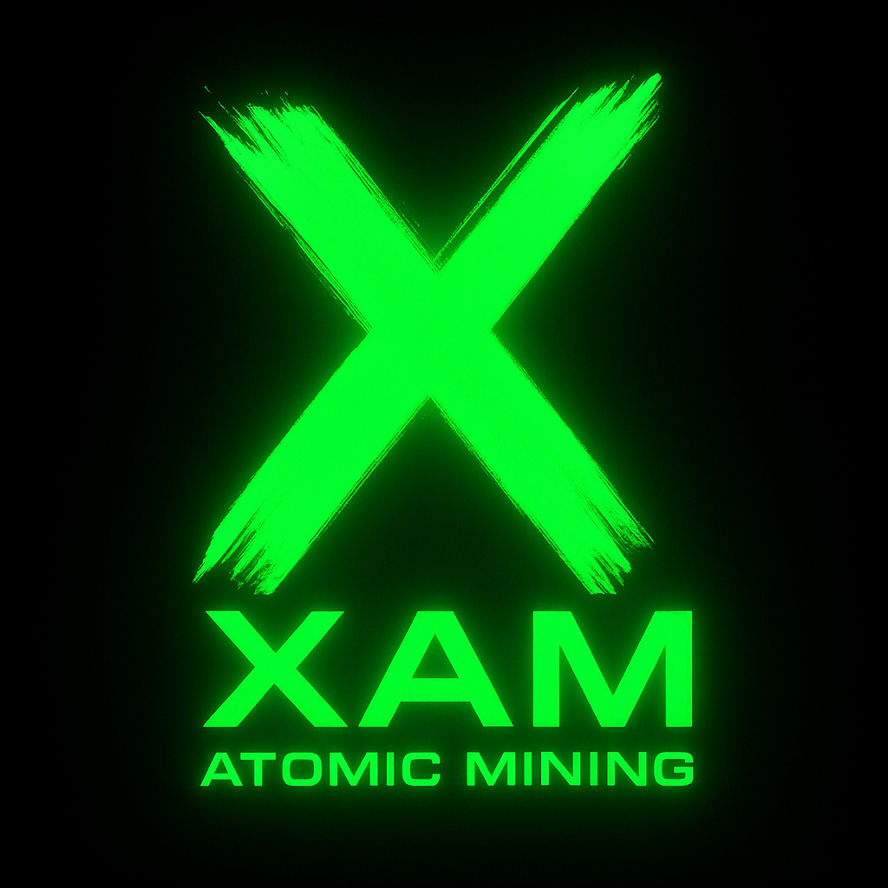

# XAM Token

**XAM** — официальный токен проекта [X-Atomic-Mining](https://github.com/Maksimgig/X_Atomic_Mining), построенный на блокчейне TON с DAG-структурой.

---

## Основные данные

- 🪙 **Символ:** XAM  
- 🔢 **Общий объём эмиссии:** 6,000,000,000  
- 🔗 **Блокчейн:** TON  
- 📄 **Контракт:** (будет опубликован после деплоя)
- 🧬 **Технология:** DAG-транзакции поверх Jetton стандарта

---

## Логотип

---

## Проект

- GitHub: [X-Atomic-Mining](https://github.com/Maksimgig/X_Atomic_Mining)  
- Twitter: [@XAM on X](https://x.com/MHohotva)

---

> XAM — токен нового поколения с DAG-скоростью и атомной точностью.
